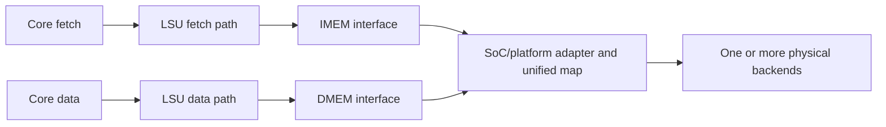

# RV32I Memory Subsystem Design Contract

**Scope:** Generic core/LSU transactions and physical-memory adaptation

**Execution environment:** [RV32I Execution-Environment Contract](../../Philosophy/RV32I_Execution_Environment_Contract.md)

**Platform roadmap:** [RV32I SoC and Platform Roadmap](../../Roadmap/RV32I_SoC_and_Platform_Roadmap.md)

**Governing architecture:** [RV32I Core Architecture](../../Philosophy/RV32I_Core_Architecture.md)

**LSU contract:** [RV32I LSU Design Contract](../Execution/RV32I_LSU_Contract.md)

**Core integration:** [RV32I Core Design Contract](../RV32I_Core_Design_Contract.md)

## 1. Purpose

This document defines the stable boundary between core/LSU memory semantics and physical memory backends. RTL is authoritative for concrete interface declarations and adapter implementations. This contract defines the transaction format, protocol, and ownership rules.

The terms **shall**, **shall not**, and **may** denote a requirement, a prohibition, and an implementation choice, respectively.

## 2. Layering

The memory subsystem shall retain the following structure:

The IMEM and DMEM paths shall use separate instances of `rv32_mem_if` while carrying addresses from one unified architectural address space. This separation is a Core microarchitectural boundary, not architectural Harvard memory. Adapter functionality is required between each generic interface and any physical backend. A SoC may implement separate adapters or one combined adapter that routes both paths to shared physical storage.

The LSU shall define ISA-level memory semantics. Adapters shall define mapping and physical access. A backend shall receive only local or backend-native transactions.

## 3. Generic Interface Format

The requester-to-adapter fields are:

| Field | Meaning |
| --- | --- |
| `req` | Level-sensitive transaction-valid request |
| `we` | Write enable; clear for reads |
| `addr[31:0]` | Full architectural byte address |
| `wdata[31:0]` | Write data positioned in architectural byte lanes |
| `wstrb[3:0]` | Valid-byte mask corresponding to the four `wdata` lanes |

The adapter-to-requester fields are:

| Field | Meaning |
| --- | --- |
| `ready` | Completion of the active transaction |
| `rdata[31:0]` | Raw read-data word in architectural byte-lane order |
| `err` | Transaction failure, valid only with `ready` |

The interface declaration and modports in `rv32_mem_if` are authoritative for signal ownership. IMEM transactions shall be reads and shall drive inactive write fields to zero.

## 4. Transaction Protocol

`req` shall remain asserted for the lifetime of a transaction. While `req && !ready`, the requester shall hold `we`, `addr`, `wdata`, and `wstrb` stable.

A transaction completes when `req && ready` is observed on a rising clock edge. Completion is successful when `err` is clear and unsuccessful when `err` is set. The invariant `err -> ready` shall hold at the generic boundary.

After completion, the requester shall deassert `req` before issuing another transaction on the same interface. Request deassertion terminates the transaction; no separate completion or error-clear command exists.

The protocol is non-pipelined and permits at most one outstanding transaction per interface. The baseline core shall not overlap an instruction transaction with a data transaction.

The requester shall not assume combinational response or fixed latency. An adapter may complete immediately or after arbitrary backend delay while preserving this protocol.

## 5. Address and Data Conventions

### 5.1 Address

Both interfaces shall carry full 32-bit byte addresses in the same architectural address space. The core and LSU shall not subtract a region base, truncate an address to backend width, convert it to a word index, or maintain distinct software-visible IMEM and DMEM maps.

### 5.2 Writes

`wdata` shall be lane-positioned before crossing the adapter boundary. `wstrb[n]` qualifies `wdata[8*n +: 8]`. The adapter shall preserve this byte-lane meaning when converting to backend-native byte enables or bus writes.

The adapter shall not infer ISA transfer width from the address or decode an LSU operation.

### 5.3 Reads

`rdata` shall be a raw 32-bit container in architectural byte-lane order. The LSU, not the adapter, shall perform data-load lane selection and sign or zero extension.

## 6. Adapter Requirements

### 6.1 Common responsibilities

For every connected generic interface, the adapter layer shall:

- accept the corresponding responder-side `rv32_mem_if` connection;
- validate the configured architectural address range;
- translate the architectural byte address into a backend-local address;
- sequence backend requests and hide backend latency;
- translate generic write data and strobes into backend-native operations;
- return generic read data and transaction-scoped errors;
- complete and clean up a transaction without an additional core/LSU clear protocol; and
- preserve the outstanding-transaction limit.

Memory-region bases, sizes, permissions, local address widths, physical topology, and routing options belong to the SoC/platform and may be elaboration-time parameters. Generated linker/platform inputs and any discovery structure shall describe that same implementation to software. Current shared-RAM defaults are example values rather than Core or LSU invariants. Selecting unified or separate backends shall not change the unified architectural map or Core/LSU transaction contract.

### 6.2 IMEM-path adaptation

The IMEM adapter shall implement instruction-region mapping and read sequencing. It shall return one instruction word or a failed completion for an unmapped or backend-failed access.

### 6.3 DMEM-path adaptation

The DMEM adapter shall preserve LSU-generated write lanes and shall return raw 32-bit read data. It may route requests among RAM, MMIO, ROM where permitted, or an external bus, but shall not repeat load signedness, load extension, or store-width decoding. Caches are outside the baseline scope.

## 7. Sequencing Ownership

The multicycle core shall own fetch and data-request lifetime. It shall hold the corresponding core-to-LSU request inputs stable and shall not advance the active fetch, load, or store phase until completion.

The LSU shall remain stateless. Each adapter may contain the state required for physical mapping, synchronous memory latency, bus handshakes, or backend cleanup.

## 8. Error Boundary

Adapter and backend failures, including unmapped, permission-invalid, and unsupported transactions, shall be reported as `ready && err`. Errors are transaction-scoped and shall clear through normal request teardown. LSU/Core converts the failed transaction into the applicable instruction, load, or store access-fault exception.

LSU-local validation errors may complete at the core-facing LSU boundary without issuing an adapter transaction. Architectural trap generation and policy remain outside the generic memory interface.

## 9. Conformance and Change Control

Verification shall demonstrate that:

- IMEM and DMEM use independent interface instances;
- request fields remain stable until completion;
- completion and error obey the protocol invariants;
- architectural addresses are not rebased before the adapters;
- store data and strobes retain their lane meaning across each adapter;
- data-load extraction and extension remain in the LSU;
- synchronous and delayed backends require no core-side timing change; and
- replacing a backend or changing map parameters does not change core/LSU transaction semantics.

This contract requires revision if the generic field meanings, request lifetime, completion semantics, lane convention, logical IMEM/DMEM boundary, unified architectural address model, or concurrency model changes. Backend choice, region parameters, and adapter-internal state do not require revision while these boundaries remain unchanged.
