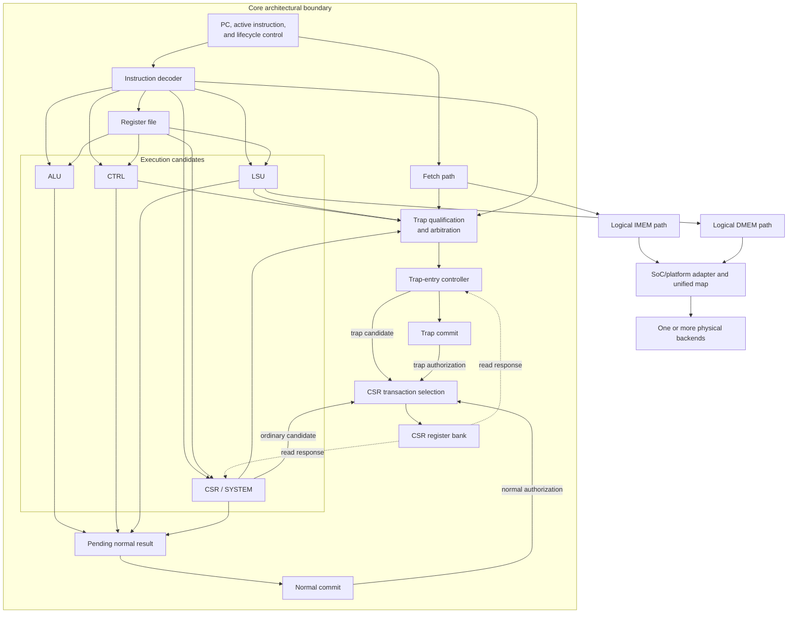
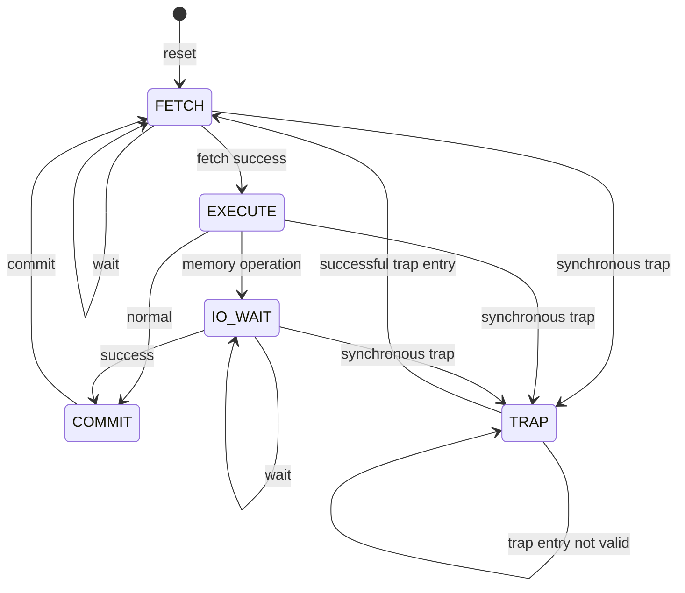

# RV32I Core Architecture

**Scope:** System structure and architectural ownership for the baseline RV32I core

**Execution environment:** [RV32I Execution-Environment Contract](RV32I_Execution_Environment_Contract.md)

**Software contract:** [RV32I Software Authoring Contract](RV32I_Software_Authoring_Contract.md)

**Core contract:** [RV32I Core Design Contract](../Implementation/RV32I_Core_Design_Contract.md)

**Architecture roadmap:** [Exceptions, Traps, and Extensions](../Roadmap/RV32I_Exceptions_Traps_and_Extensions_Roadmap.md)

**Platform roadmap:** [RV32I SoC and Platform Roadmap](../Roadmap/RV32I_SoC_and_Platform_Roadmap.md)

**RTL naming:** [RV32I RTL Naming Contract](RV32I_RTL_Naming_Contract.md)

## 1. Purpose

This document records the stable architecture of the core: design philosophy, overall structure, abstract state and execution models, and responsibility boundaries. It does not define module ports, enum encodings, instruction tables, concrete state encoding, or cycle-level signal assignments.

The RISC-V Unprivileged ISA specification governs architectural instruction behavior. Module RTL and tests govern implemented interfaces and mappings. The linked module contracts refine the boundaries summarized here.

The terms **shall**, **shall not**, and **may** denote a requirement, a prohibition, and an implementation choice, respectively.

## 2. Architectural Philosophy

The baseline processor shall be a multicycle, in-order, single-hart core with at most one architectural instruction in progress. It shall not depend on pipelining, speculative execution, or multiple outstanding memory transactions.

The architecture favors explicit instruction lifetime and ownership over minimum cycle count. Execution units describe semantic transformations; the core owns sequencing and architectural state. A module boundary does not imply a cycle boundary.

The decoder shall expose instruction semantics and an encoding-trap candidate rather than cycle controls. The core shall resolve architectural register indices into values before invoking ALU, CTRL, LSU, or CSR/SYSTEM execution.

The core shall use one synchronous clock for persistent state. Completion, error, and trap signals are sampled conditions and shall not be used as clocks.

## 3. System Structure

Instruction fetch and data access use one 32-bit architectural address space. They remain separate logical IMEM and DMEM paths only at the Core microarchitectural boundary. The LSU boundary owns fetch pass-through and ISA-level data semantics; SoC/platform adapters own the unified map, permissions, routing, and physical topology. Both paths may terminate in one shared physical RAM or in different backends without creating separate software-visible address spaces.

## 4. Responsibility Boundaries

| Component | Architectural responsibility |
| --- | --- |
| Core | Instruction lifetime, PC and IR ownership, register-file access, execution scheduling, pending results, memory-request lifetime, trap-source qualification and arbitration, and architectural commit or trap entry |
| [Core-owned state](../Implementation/State/RV32I_Core_Owned_State_Design_Contract.md) | Implementation-defined instruction-lifetime state that preserves the abstract stability and commit invariants |
| [Instruction decoder](../Implementation/Controller/RV32I_Instruction_Decoder_Design_Contract.md) | Translation from instruction bits to semantic fields and reporting of illegal or unsupported encodings |
| [Register file](../Implementation/State/RV32I_Register_File_Design_Contract.md) | Architectural GPR storage and preservation of `x0` |
| [ALU](../Implementation/Execution/RV32I_ALU_Design_Contract.md) | Integer operation on supplied values |
| [CTRL](../Implementation/Execution/RV32I_CTRL_Design_Contract.md) | Branch/jump evaluation, complete control-transfer next PC, jump link value, and applicable target-alignment traps |
| [LSU](../Implementation/Execution/RV32I_LSU_Contract.md) | Fetch pass-through, data effective address, alignment, width, lane, extension semantics, memory-fault traps, and defensive invalid-uop traps |
| [CSR/SYSTEM controller](../Implementation/Execution/RV32I_CSR_SYSTEM_Design_Contract.md) | Zicsr instruction semantics, exact SYSTEM interpretation, conversion of illegal bank responses into trap candidates, and controller-generated CSR transactions |
| [Trap controller](../Implementation/Controller/RV32I_Trap_Controller_Design_Contract.md) | Construction and legality qualification of machine trap-entry CSR and Direct-mode PC candidates from a retained report |
| [CSR register bank](../Implementation/State/RV32I_CSR_Register_Bank_Design_Contract.md) | Architectural CSR views, address dispatch, field/reset semantics, transaction validation, and atomic state commitment |
| [Memory adapters](../Implementation/IO/RV32I_Memory_Subsystem_Design_Contract.md) | Unified-map validation, local-address translation, backend timing, routing, and external error reporting |

Execution units shall not access the register file, select destination registers, or commit architectural state. The core shall not repeat raw instruction decoding or embed the physical memory map.

Trap detection is decentralized: each unit shall report only conditions within its semantic responsibility through `rv32_trap_pkg::trap_req_t`. The CSR register bank returns operation legality but is not itself an architectural trap source; the CSR/SYSTEM controller converts an illegal instruction-directed bank response into a trap candidate. Trap handling is centralized: Core qualifies active sources, selects and retains one report, then uses `rv32_trap` to construct the machine trap-entry CSR and PC candidates. Core alone authorizes atomic bank commitment and exceptional PC update. A unit without an architecturally meaningful exceptional condition shall not receive a trap output solely for interface symmetry.

## 5. State Model

Architectural state consists of the PC, general-purpose registers, machine trap state required by the supported environment, and committed memory-visible effects. The implementation may retain nonarchitectural state including the current instruction, pending register result, pending next PC, pending trap report, and FSM state.

The PC and current instruction shall identify the same instruction throughout its execution lifetime. They shall remain stable from successful fetch completion until that instruction reaches the commit boundary or an exception path supersedes normal completion. Decoded semantics, operands, and memory-request fields need not be duplicated into Core registers when they remain deterministic functions of invariant retained state.

Execution shall first produce either pending normal values or a trap candidate. Normal PC, GPR, and instruction-directed CSR updates shall occur only at `COMMIT`. A qualified exception shall instead update trap state and trap PC through `TRAP`, with no normal completion from the faulting instruction. A completed store may already be memory-visible before the subsequent PC/GPR commit; `COMMIT` is therefore not a rollback mechanism for accepted stores.

## 6. Abstract Instruction Lifecycle

- **FETCH** owns one instruction transaction and considers only the fetch-path trap candidate.
- **EXECUTE** gives the decoder trap precedence, then considers only the specialist unit selected by the decoded execution class.
- **IO_WAIT** owns one data transaction and considers only the data-side LSU trap candidate.
- **COMMIT** applies pending normal PC, GPR, and CSR effects and accepts no synchronous trap from the completing instruction.
- **TRAP** applies the selected architectural trap state and starts the next fetch at the trap vector.

These unprefixed names define the abstract model. Their concrete RTL mappings and signal assignments belong to the Core design contract and RTL.

## 7. Data and Control Flow

The decoder shall emit typed instruction meaning and an encoding-trap candidate. Core shall resolve architectural register references into values and schedule the selected specialist boundary. A decoder trap shall suppress architectural acceptance of every normal or specialist candidate, although combinational evaluation need not be physically gated.

Execution specialists shall own the semantic transformations assigned in Section 4 and shall return candidates rather than committing state. Core shall select the applicable normal result or trap report and authorize exactly one architectural exit path. Concrete operand, result, and PC selection belong to the [Core design contract](../Implementation/RV32I_Core_Design_Contract.md#6-datapath-and-result-selection).

Memory paths shall carry full architectural byte addresses to SoC/platform adapters and shall tolerate arbitrary adapter latency under the transaction contract. CSR producers shall share one atomic register-bank boundary; Core shall select and authorize one transaction source without requiring every producer to pass through the CSR/SYSTEM instruction controller.

## 8. Scope and Evolution

The machine timer interrupt is the only interrupt source in the planned baseline. Its integration milestone shall add Vectored-mode trap support together with the SoC timer source, synchronization, sampling, and arbitration. Other interrupt families may be considered only after that milestone and concrete SoC hardware requirements exist.

Caches, store buffers, pipelining, speculation, out-of-order memory execution, parallel Core transactions, multiple harts, coherent/cache-visible independent masters, lower privilege modes, PMP, MMU, and virtual memory are explicit baseline non-goals. Additional ISA extensions require separate architecture work when they change a responsibility boundary or abstract invariant.

Changes limited to ports, state encoding, mux structure, or cycle optimization belong to RTL, module contracts, or the [Core design contract](../Implementation/RV32I_Core_Design_Contract.md). Physical maps and device parameters belong to the [SoC/platform roadmap](../Roadmap/RV32I_SoC_and_Platform_Roadmap.md). Identifier form and naming migrations are governed by the [RTL naming contract](RV32I_RTL_Naming_Contract.md).
